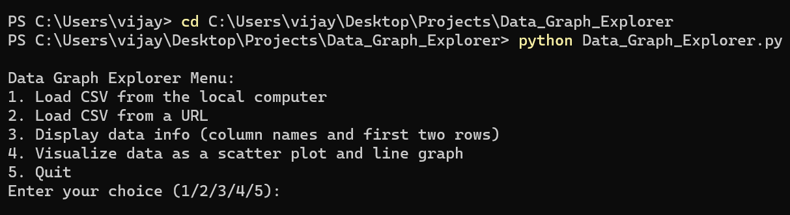
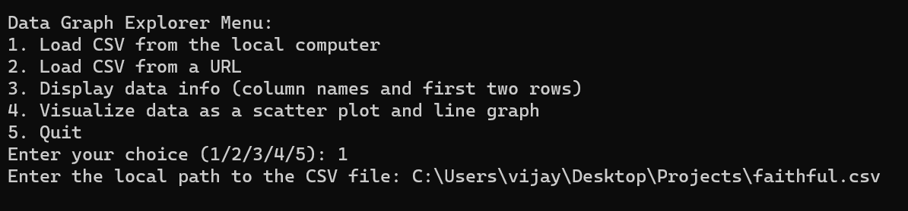
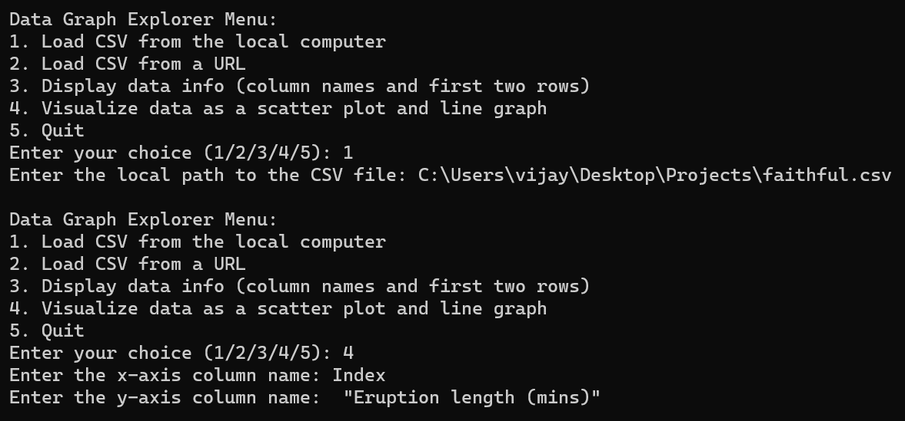
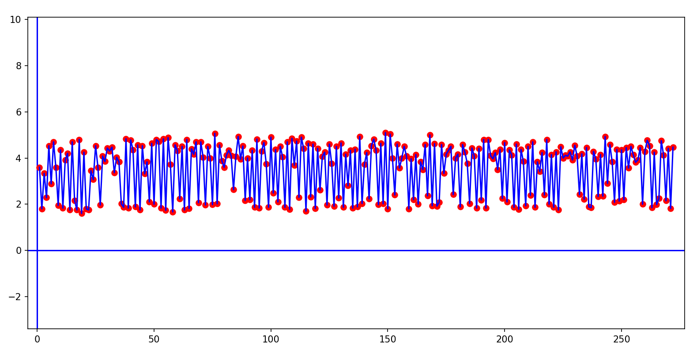

<h1>Data Graph Explorer</h1>

<h2>Description</h2>
This Python program is a mathematical utility designed to assist users in visualizing equations, solving systems of equations, and analyzing quadratic functions. Its menu-driven interface offers easy access to a range of mathematical tasks, including the display of graphs and tables for user-provided equations, system equation solving, graph plotting with intersection points, and quadratic equation analysis.
 

<h2>Languages and Utilities Used</h2>

- <b>Python</b>

<h2>Environments Used </h2>

- <b>Windows 11</b>
- <b>Visual Studio Code</b>

<h2>Program walk-through:</h2>

Launch the file:  

 
 

Choose option 1 or 2 to upload or link your csv. file and input the information for processing:   

 
 

Next choose the option 3 or 4 to display data info or visualize data as a scatter plot and line graph:  

 
 

If you choose option 4, another tab will open with your graph:  

 
 
